# 🩺 PulseMeet –  Full-Stack Telemedicine Appointment App

PulseMeet  is a fully-featured, production-ready **telemedicine platform** that allows patients to consult doctors via **secure video calls**, **book appointments**, and **subscribe to plans** using a **credit-based system**. Built with the modern Next.js 14 App Router, it supports **full authentication**,** role-based access**, **real-time scheduling**, and **billing**.

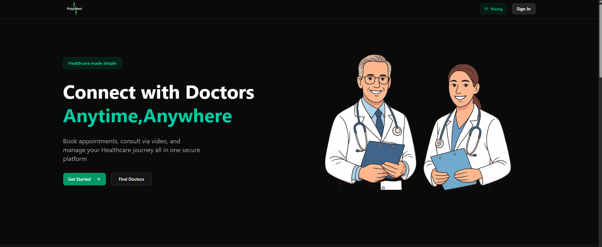 

🔗 [Live Demo (Vercel)](https://pulsemeet.vercel.app)  

[]( https://www.typescriptlang.org/ )[]( https://nextjs.org/ )[]( https://tailwindcss.com/ )[]( https://www.prisma.io/ )[]( https://clerk.dev/ )[](https://neon.tech)
[](https://www.vonage.com/communications-apis/video)
[]( https://resend.com/ )[](https://vercel.com)

---

## 🧠 Features

- 🔐 **Clerk Authentication with Role-Based Access**  
  Sign up or log in as a **Patient** or **Doctor** using secure, production-ready authentication via Clerk (Google OAuth supported).  
  - Routes are protected using Clerk middleware and server-side session validation.  
  - Role-based dashboards with custom flows for **Patients**, **Doctors**, and **Admins**.  
  - Admins have elevated privileges to manage users and application-wide settings.

- 🧑‍⚕️ **Doctor Onboarding & Profile Verification**  
  - Doctors submit credentials, specialties, and experience to create a verified professional profile.  
  - Admins review, approve, or reject applications from doctors.  
  - Verified doctors become publicly discoverable by patients.

- 📅 **Availability Management & Smart Scheduling**  
  - Doctors configure availability in flexible time slots.  
  - Slots are automatically marked as **booked** or **blocked** to avoid overlaps.  
  - Patients view only real-time, available slots per doctor.

- 🗓️ **Real-Time Appointment Booking**  
  - Patients book appointments directly from the doctor’s profile.  
  - Confirmations update doctor schedules in real-time.  
  - Appointments can be canceled before start time.  
  - Bookings are only allowed if patients have sufficient credits.

- 📹 **1:1 Encrypted Video Consultations (Vonage API)**  
  - Each confirmed appointment auto-generates a private video session.  
  - Built-in video call interface supports:  
    - Mute/unmute audio  
    - Toggle video  
    - End call  
  - Session metadata is securely managed.

- 📝 **Post-Consultation Notes & Documentation**  
  - Doctors can add summary notes after each session.  
  - Notes are saved and linked to the appointment record for future reference.

- 💳 **Credit-Based Subscription Billing (via Clerk + Stripe)**  
  - Patients subscribe to Basic (Free), Standard, or Premium plans.  
  - Each plan grants a fixed number of credits monthly.  
  - Appointments consume credits; credit usage is logged per session.  
  - Subscriptions are managed via Clerk’s native billing dashboard.

- 💼 **Doctor Dashboard with Earnings & Appointments**  
  - Track upcoming appointments and join sessions.  
  - Monitor total credits earned.  
  - Initiate withdrawal requests for earned credits.  
  - Manage weekly/monthly earnings at a glance.

- 🛡️ **Admin Control Panel**  
  - Review and approve pending doctor applications.  
  - Verify credentials and license URLs.  
  - View all users, appointments, and transactions.  
  - Approve or reject withdrawal requests from doctors.

- 📊 **Credit Transaction Ledger**  
  - All credit movements (purchase, deduction, refund) are logged in the database.  
  - Helps in transparent audit trails and billing reconciliation.

- 📬 **Automatic Clerk Email Notifications**  
  - Users receive transactional emails (sign-in, verification, password recovery, etc.) out of the box.  
  - Profile updates and subscription changes trigger instant notifications.

- 🌙 **Responsive, Accessible UI with Dark Mode**  
  - Fully responsive across mobile, tablet, and desktop devices.  
  - Built with ShadCN UI and TailwindCSS.  
  - Dark mode support with smooth transitions and theme toggles.

---

## ⚙️ Server Actions & Event Workflows


| Action / Workflow             | Trigger Point                          | Purpose                                                                 |
|-------------------------------|----------------------------------------|-------------------------------------------------------------------------|
| `checkUser()`                 | On login/session                       | Syncs Clerk user with local DB and assigns role                        |
| `bookAppointment()`          | When patient books slot                | Deducts credits, locks doctor slot, creates video session via Vonage   |
| `cancelAppointment()`        | On cancellation before session start   | Restores credits, frees doctor slot                                    |
| `createDoctorAvailability()` | Doctor sets calendar availability      | Stores time slots in DB with availability state                        |
| `processWithdrawal()`        | Doctor requests payout                 | Creates admin-verifiable payout request                                |
| `assignCreditsOnSubscribe()` | Clerk webhook / billing update         | Adds credits to patient based on subscription tier                     |
| `verifyDoctor()`             | Admin approves doctor application      | Marks doctor as verified and grants platform visibility                |

---

## 📸 Screenshots

### 🏠 Landing & Onboarding

| Landing Page | Homepage | Onboarding |
|--------------|----------|------------|
|  | 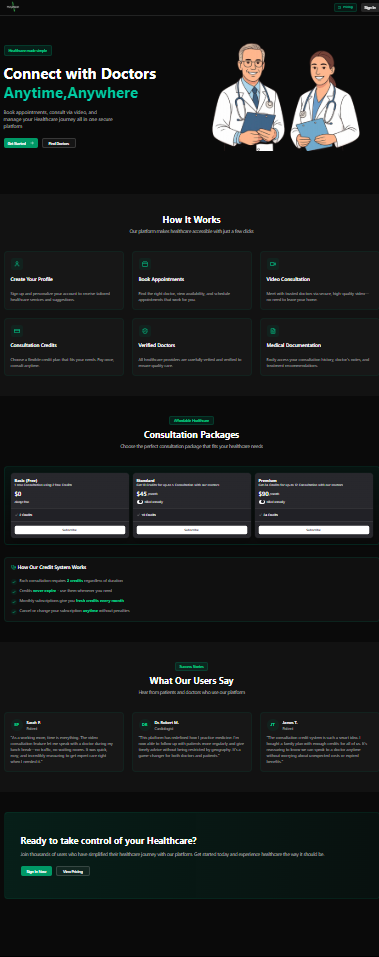 | 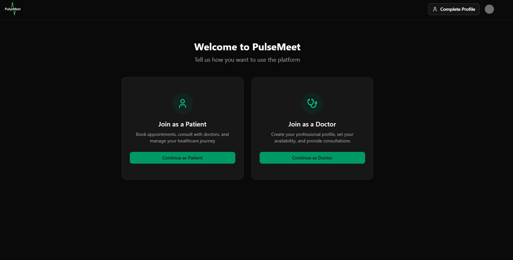 |

---

### 🧑‍⚕️ Doctor Experience

| Doctor Dashboard | Set Availability | Appointments |
|------------------|------------------|--------------|
| 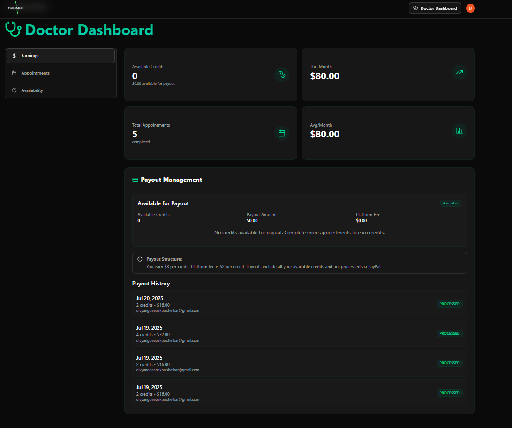 | 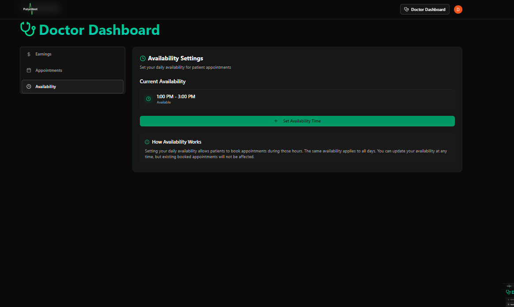 | 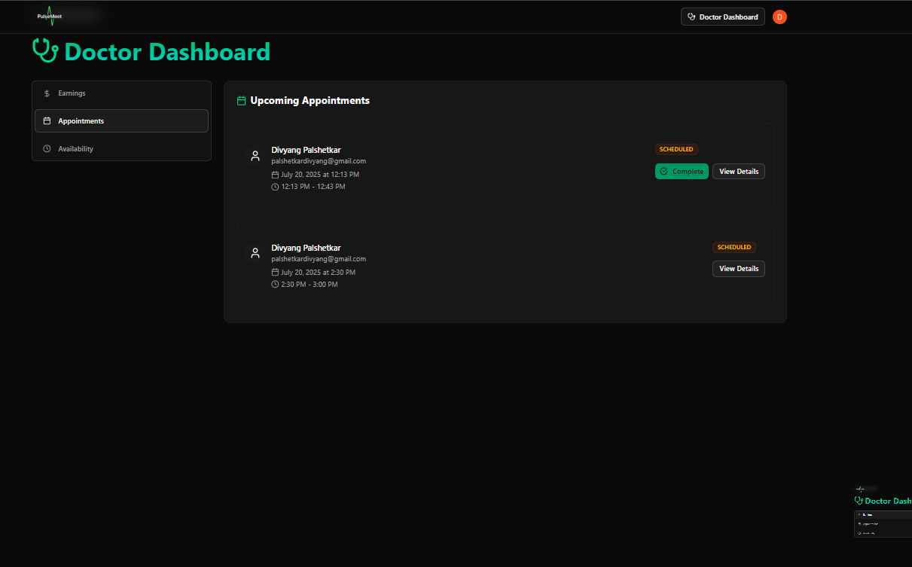 |

| Doctor Form | Dialog (Video Call) |
|-------------|---------------------|
| 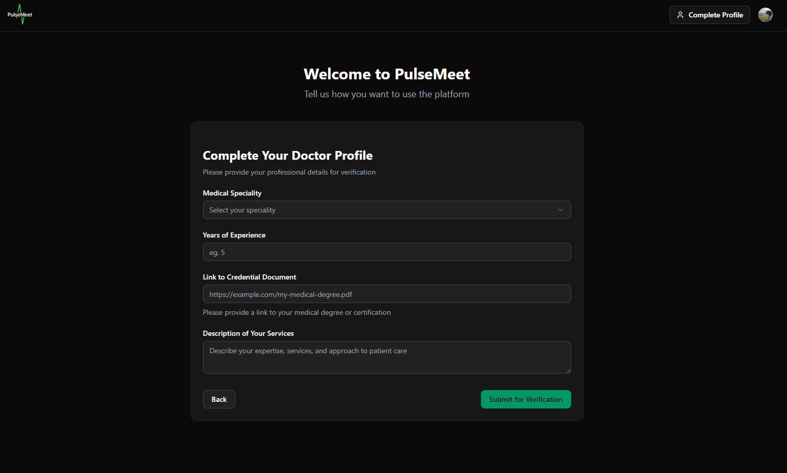 | 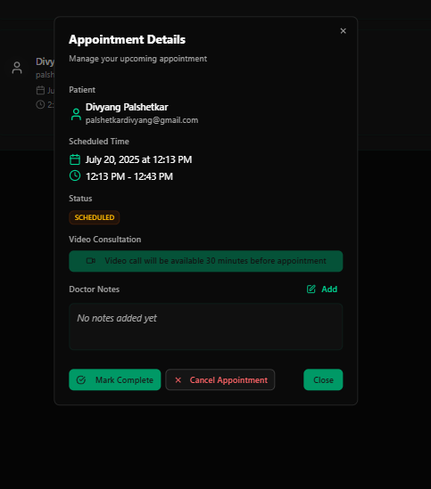 |

---

### 🧍 Patient Experience

| Find a Doctor | Doctors Listing | Doctor Description |
|---------------|------------------|---------------------|
| 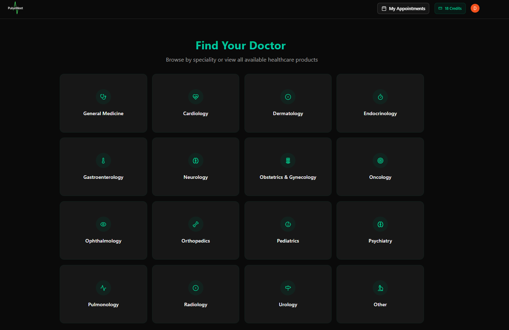 | 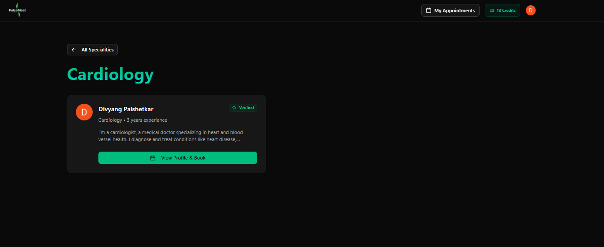 | 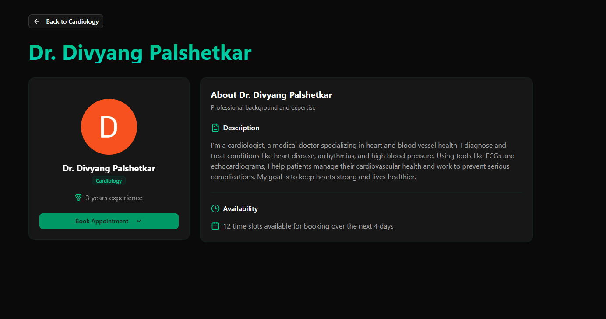 |

| Slot Booking | My Appointments | Patient Video Dialog |
|--------------|------------------|-----------------------|
| 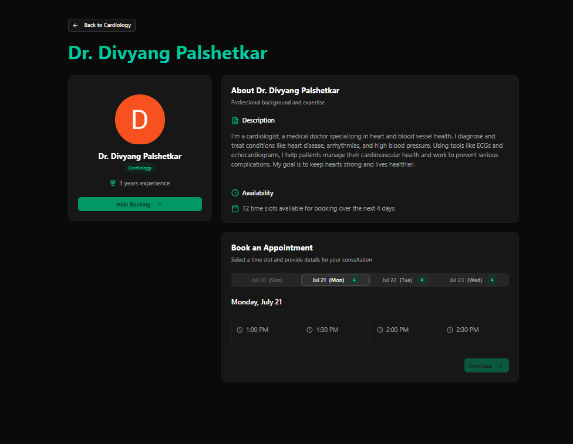 | 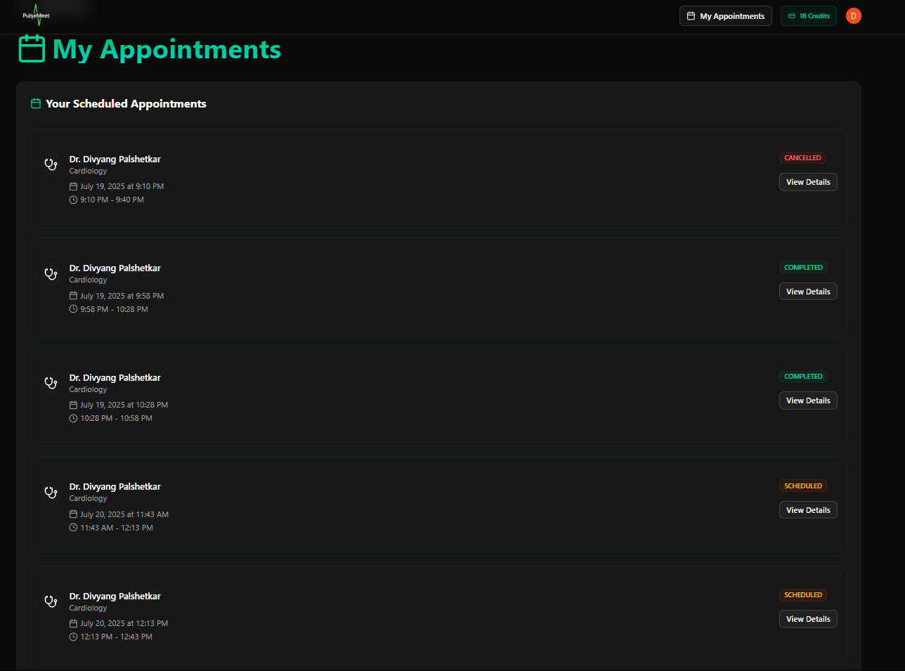 | 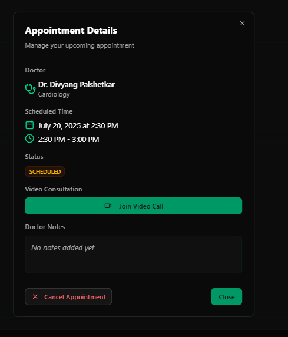 |

---

### 🛡️ Admin Dashboard

| Verification Queue | Manage Doctors | Process Payouts |
|--------------------|----------------|-----------------|
| 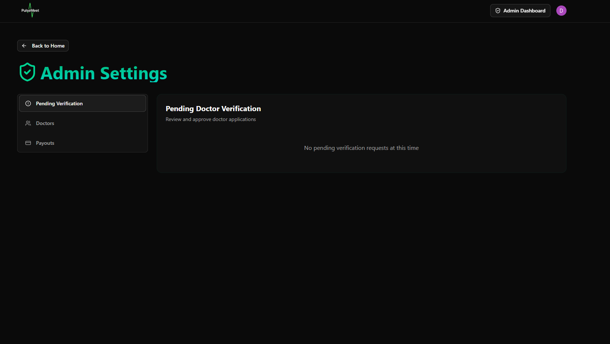 | 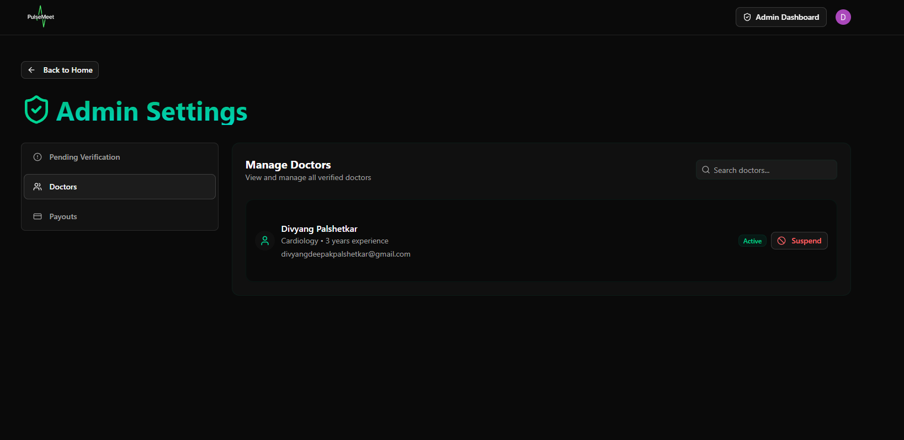 | 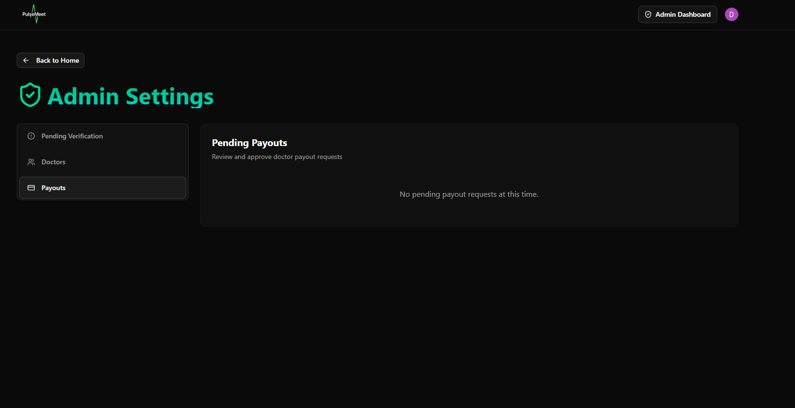 |

---

### 💳 Pricing & Consultations

| Pricing Page | Video Consultation |
|--------------|--------------------|
|  | 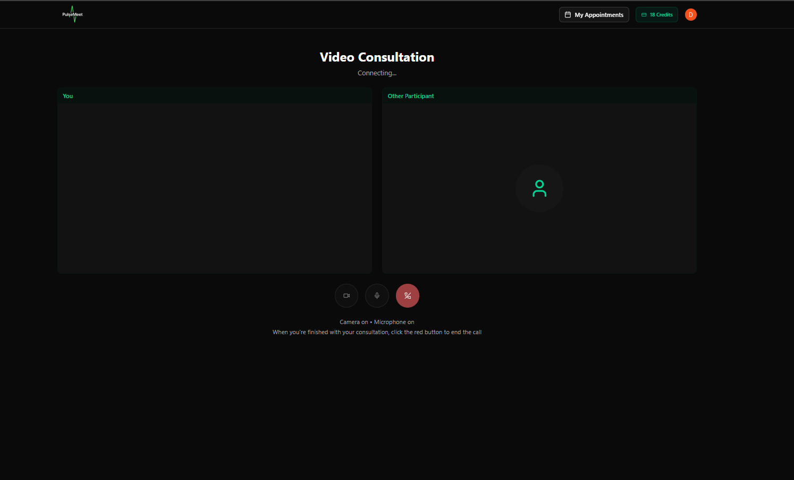 |

---

## 🚀 Tech Stack

| Area        | Tech Stack |
|-------------|------------|
| **Frontend**   | Next.js 14 App Router, React 19, Tailwind CSS, ShadCN UI                    |
| **Database**   | PostgreSQL (hosted on Neon), Prisma ORM                                     |
| **Auth**       | Clerk (with social login, middleware, custom roles)                        |
| **Email** | Resend |
| **Video Calls**| Vonage Video API (2000 free minutes)                                        |
| **Payments**   | Clerk Subscriptions                                    |
| **CI/CD**    | Vercel + GitHub Actions |

---

## 💸 Credit-Based Subscriptions

| Plan Name             | Credits           | Price | Use Case |
|----------------------|--------------------|---------|
| `Basic`      | 2  | Free | One free consultation |
| `Standard` | 10      | $50 | ~5 consultations/month |
| `Premium`  | 24       | $100 | ~12 consultations/month |

Credits are deducted upon booking. Users must maintain enough credits to continue.
✅ Powered by [Clerk](https://clerk.com/) – Comprehensive User Management Platform.

---
## 🎥 Secure, In-Browser Video Consultations

PulseMeet integrates the **Vonage Video API** to enable real-time, secure, 1:1 video consultations between doctors and patients — no third-party tools required.

| Feature                          | Description                                                                 |
|----------------------------------|-----------------------------------------------------------------------------|
| 🔐 End-to-End Security           | Each consultation is conducted in a unique, encrypted Vonage session.       |
| 🧑‍⚕️ Role-Based Call Access      | Only the assigned **doctor** and **patient** can join the session.          |
| 🔄 Real-Time Session Handling    | Sessions are created automatically when appointments are booked.            |
| 🎛️ Call Controls                 | Participants can **mute/unmute audio**, **toggle video**, and **leave**.    |
| 📋 Session Metadata & Logging    | Appointments track session IDs and timestamps for audit and analytics.      |
| 📱 Fully In-Browser              | No downloads or installs — works across modern desktop & mobile browsers.   |
| 🌐 Auto-Adaptive UI              | Responsive, theme-aware call interface using Tailwind + ShadCN components.  |

✅ Powered by [Vonage Video API](https://www.vonage.com/communications-apis/video) — integrated securely using server-side tokens and session creation logic.

---


## 🤸 Quick Start

Follow these steps to set up the **PulseMeet –  Full-Stack Telemedicine Appointment App** project locally on your machine.

### 🔧 Prerequisites

- Git
- Node.js (v18+)
- npm

### 📁 Cloning the Repository

```bash
git clone https://github.com/yourusername/pulsemeet.git
cd pulsemeet
```
### 📦 Installation

```bash
npm install
```
#### 🧬 Prisma Setup
After installing dependencies and setting up environment variables, initialize your database:
```bash
npm i -D prisma
npx prisma init
npx prisma migrate dev --name create-models
```

### 🔐 Environment Variables

Make sure to create a `.env` file in root of your project with the following variables:

```env
NEXT_PUBLIC_CLERK_PUBLISHABLE_KEY=
CLERK_SECRET_KEY=

NEXT_PUBLIC_CLERK_SIGN_IN_URL=/sign-in
NEXT_PUBLIC_CLERK_SIGN_UP_URL=/sign-up
NEXT_PUBLIC_CLERK_AFTER_SIGN_IN_URL=/onboarding
NEXT_PUBLIC_CLERK_AFTER_SIGN_UP_URL=/onboarding

NEXT_PUBLIC_VONAGE_APPLICATION_ID=
VONAGE_PRIVATE_KEY=

DATABASE_URL=
RESEND_API_KEY=

```
Replace the placeholder values with your actual credentials.

In your lib folder, place the private.key that you will recieve from Vonage application.

### ▶️ Running the Project

```bash
npm run dev
```
Open http://localhost:3000 in your browser to view the project.

---

## 🆘 Support

If you find this project useful, consider giving it a ⭐  

---

## 🧑 Authors

- [@DivyangP2003](https://github.com/DivyangP2003)

---
## 🙏 Acknowledgements

Special thanks to the following platforms for their tools:

- [Clerk](https://clerk.dev) – authentication and user management
- [ShadCN UI](https://ui.shadcn.com/) – UI component library
- [Resend](https://resend.com) – transactional email delivery
- [Vercel](https://vercel.com) – frontend hosting and CI/CD
- [Neon](https://neon.tech) - databse and backend
- [Vonage](https://www.vonage.com) - video call generation
